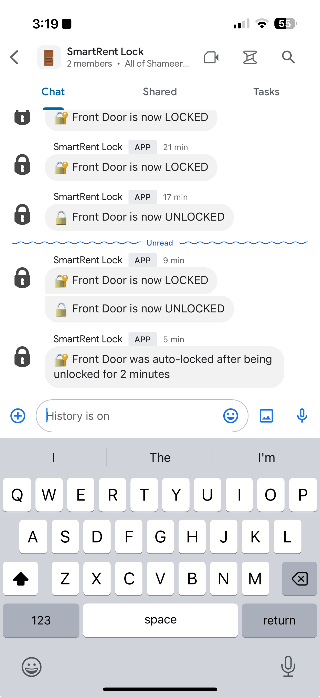

# SmartRent Lock Automation

A Google Apps Script project that provides automated monitoring and control of SmartRent door locks with Google Chat notifications.

## Screenshots




## Features

- 🔐 Real-time lock status monitoring
- 🔔 Google Chat notifications when lock status changes
- ⏰ Automatic locking after configurable time period (default: 2 minutes)
- 🔒 Manual lock control capability
- 📱 Integration with SmartRent API

## Prerequisites

1. Google Account
2. SmartRent account with a compatible smart lock
3. Google Chat webhook URL
4. [Google Apps Script](https://script.google.com/) access
5. [clasp](https://github.com/google/clasp) (optional, for local development)

## Setup Instructions

1. Create a new Google Apps Script project
2. Copy the code from `Code.js` into your project
3. Set up the following script properties in Project Settings > Script Properties:

   | Property | Description |
   |----------|-------------|
   | LOCK_DEVICE_ID | Your SmartRent device ID (TODO: Add instructions for finding device ID) |
   | LOGIN_EMAIL | Your SmartRent login email |
   | LOGIN_PASSWORD | Your SmartRent login password |
   | CHAT_WEBHOOK_URL | Google Chat webhook URL for notifications |

4. Configure a time-based triggers:
   - Create a trigger for `maybeAutoLock` (recommended: every 1 minute)

## Configuration

The script includes several configurable constants:

- `AUTO_LOCK_TIME_MINUTES`: Time in minutes before auto-locking (default: 2)

## Functions

- `checkStatusNotifyIfChanged()`: Monitors lock status and sends notifications on changes
- `maybeAutoLock()`: Automatically locks door if left unlocked for too long
- `getIsDeviceLocked()`: Retrieves current lock status
- `lockDevice()`: Locks the door
- `sendChatNotification()`: Sends notifications to Google Chat

## Testing

Use the following test function to verify Google Chat notifications:
```javascript
function testSendChatNotification(emoji = "🔐", status = "LOCKED")
```

## Security Notes

- Store credentials securely in Script Properties
- Never share your SmartRent credentials
- Regularly monitor the automation logs
- Review Google Apps Script execution logs for any issues

## Troubleshooting

1. If notifications aren't working:
   - Verify your webhook URL is correct
   - Check Script Properties are properly set
   - Review execution logs for errors

2. If auto-lock isn't working:
   - Verify triggers are properly configured
   - Check the `AUTO_LOCK_TIME_MINUTES` setting
   - Ensure SmartRent credentials are valid

